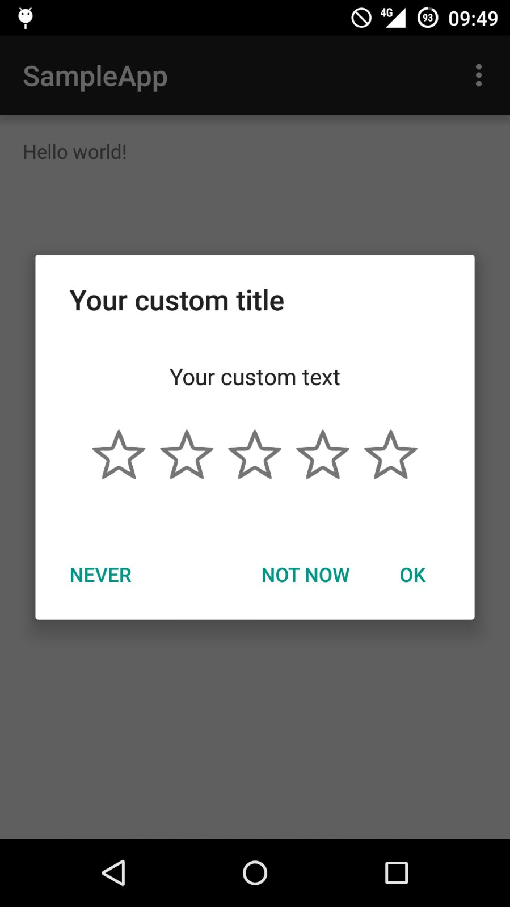

## Android Five Stars Library

Android Five Stars Library is a small library that helps developers add a **"Rate My App"** dialog to their applications.

It's called "Five Stars" because the dialog has a different behaviour based on the rating given by the user.

If the user gives **4 or 5 stars out of 5**, the user is sent to the *Google Play Store* page to give an actual rating.

If the user gives **3 or less stars out of 5**, the user is asked to *send a bug report* to the developer.

If "Force Mode" is activated, when the user selects 4/5 stars, he is immediately redirected to the Play Store, without asking for a confirm. :D

## Preview





## Installation

To use the library, first include it your project using Gradle


    allprojects {
        repositories {
            jcenter()
            maven { url "https://jitpack.io" }
        }
    }

	dependencies {
	        compile 'com.github.Angtrim:Android-Five-Stars-Library:v3.1'
	}


## How to use
To use this library just add this snippet in the `onCreate` of your activity.

The `showAfter(int numbersOfAccess)` method tells the library after how many access the dialog has to be shown.

Example:

```java
        FiveStarsDialog fiveStarsDialog = new FiveStarsDialog(this,"angelo.gallarello@gmail.com");
        fiveStarsDialog.setRateText("Your custom text")
                .setTitle("Your custom title")
                .setForceMode(false)
                .setStarColor(Color.YELLOW)
                .setUpperBound(2) // Market opened if a rating >= 2 is selected
                .setNegativeReviewListener(this) // OVERRIDE mail intent for negative review
                .setReviewListener(this) // Used to listen for reviews (if you want to track them )
                .showAfter(0);
```
## Features

The library is very simple, just note that :
* When the user tap OK or NEVER the dialog will not show again
* When the user tap NOT NOW the access counter will be reset and the dialog will be shown again after the selected times.

## Used by

If you use my library, please tell me at angelo.gallarello [at] gmail [dot] com.
So I can add your app here!


## License

Do what you want with this library.
